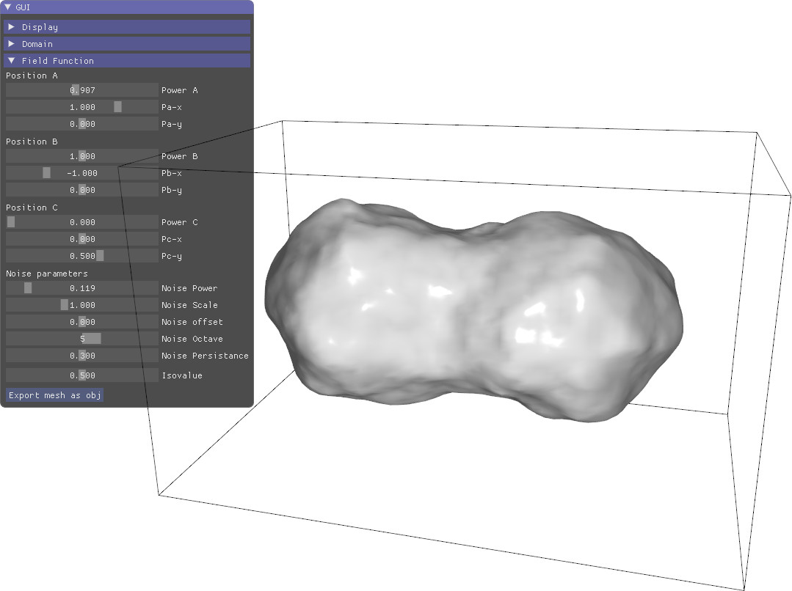

# Marching Cube (interactive)

Example of marching cube updated dynamically when the field function is modified via the GUI. The surface is made of triangle soup (duplicated vertices on shared triangle edges), and the normals are obtained from the field gradients computed from finite differences.  
The structures used in the example are more involved compared to the simple call to marching_cube, but it is compatible with more efficient update.

