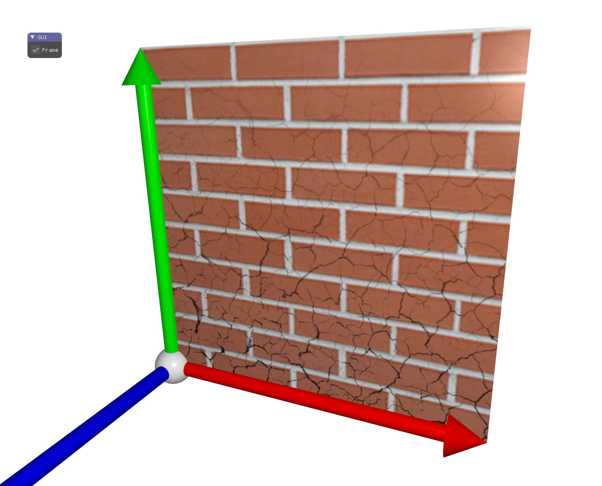

# Multiple textures

This code shows the use of a shader using two textures. The two textures are blended together in multiplying their respective color. The amount of blending is modified based on the (u,v) coordinates.

