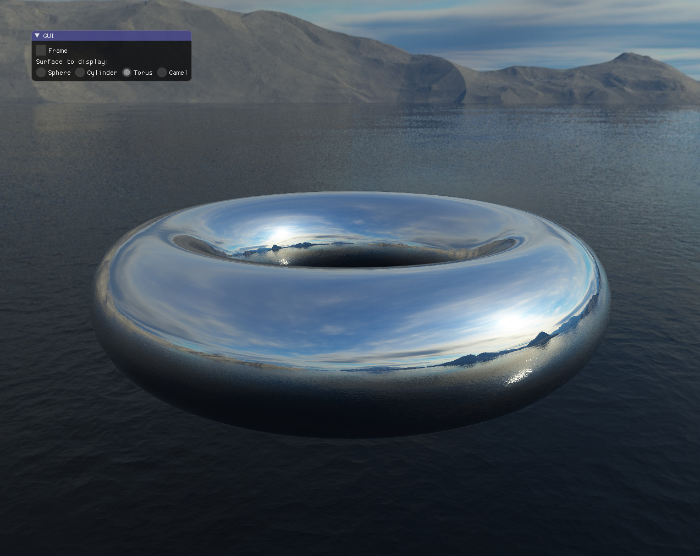

# Environment mapping

This code shows the use of environment (/reflection) mapping. A "Skybox" is displayed in the background = a cube with a seamless environment texture that follows the user. And the main shape is displayed with a reflective mapping (the normal of the shape indicates which part of the texture is displayed).

More info on <a href="https://learnopengl.com/Advanced-OpenGL/Cubemaps">learnopengl.com</a> for the principle and shaders.
