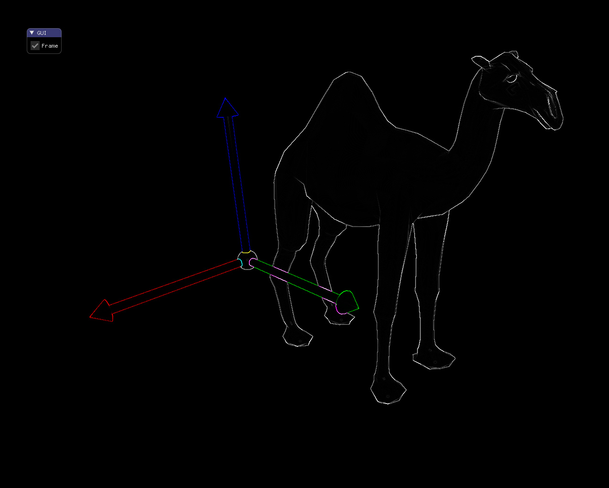

# Image filter

This code shows a multi-pass render using a Frame Buffer. In a first pass a scene is render and stored as a texture. In the second pass, the image is filtered using a second derivative convolution kernel and displayed finally on screen.

