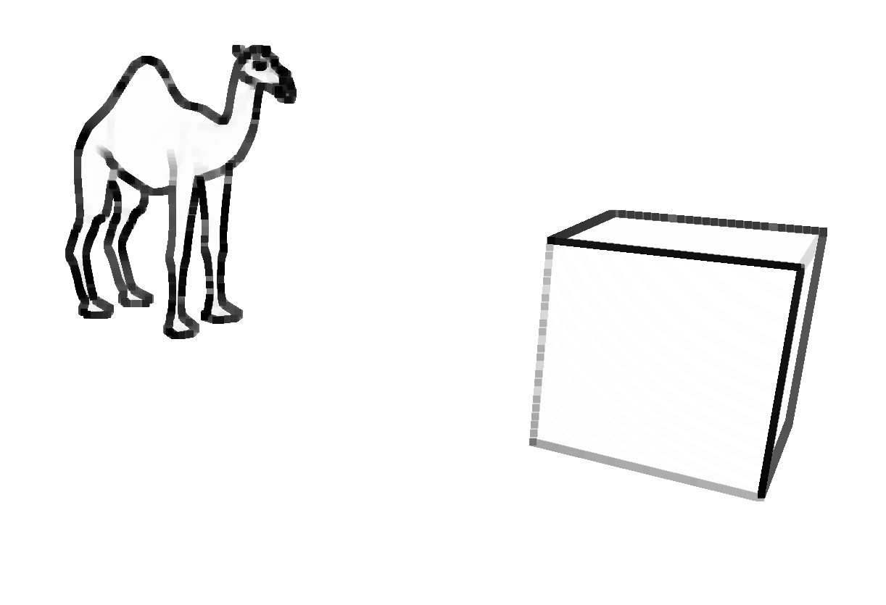

# Image filters chain

This code shows a multi-pass render using two consecutive Frame Buffer (three passes in total).  

* In a first pass, the objects are displayed and the image is stored in a texture
* In a second pass, the resulting image is filtered and the result is stored in another texture
* In a third pass, the last image texture is thickened using a dedicated shader taking the thickness value as uniform parameter. The result is displayed on the screen.

