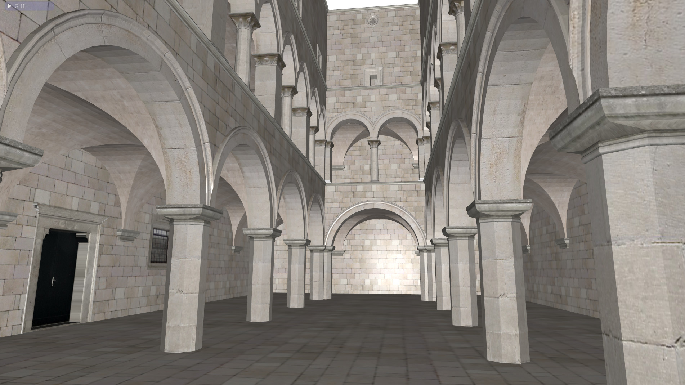

# Advanced obj Mesh loading

Example of use of the advanced obj loader using tinyobj.
https://github.com/tinyobjloader/tinyobjloader

Allows to load obj mesh files made of multiple parts with several textures.

